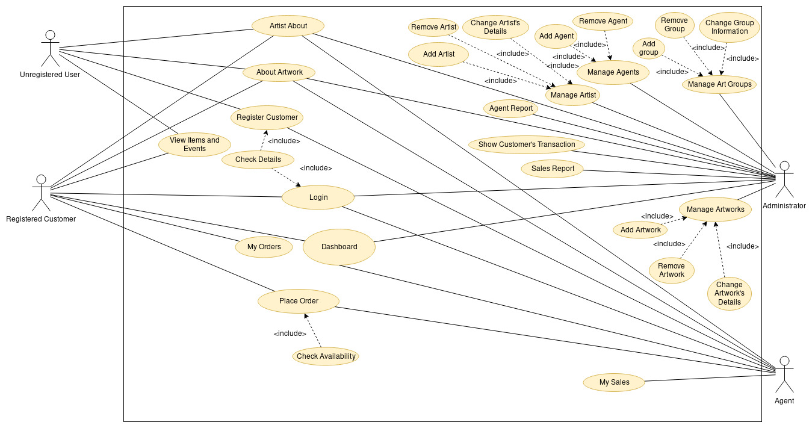
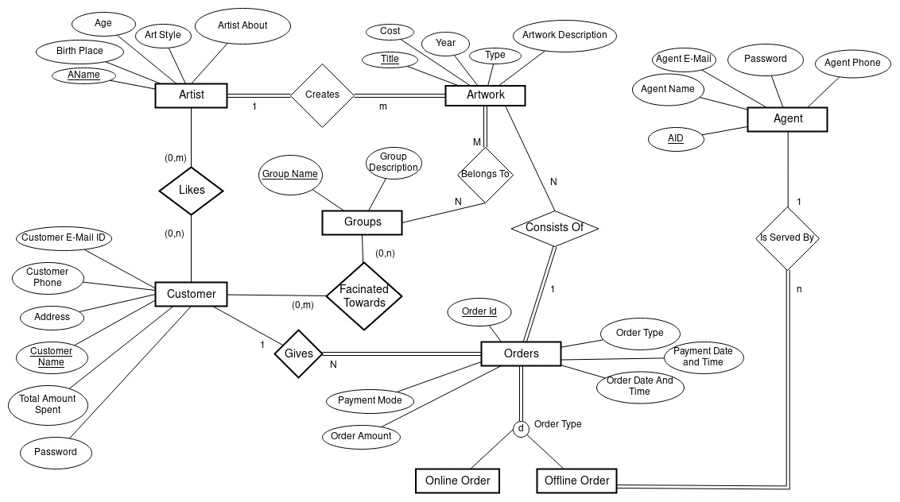

# Art-Gallery-Management DataBaste
This application maintains the database for Art Gallery. It maintains the records of the available art works along with the artists details, genre details. Also this application allows a customer to buy art work from the Application

This was my Project for our Group in 5th Semester DBMS Project

This application mainly consists of three types of Users:-
1. Administrator
2. Customer *(Registered or Un-Registered)*
3. Agent or Employees who works in the Art Gallery

The Use Case Diagram for this application is as follows:-

The ER Diagram for this application is as follows:-

This application has been built using:-
1. PHP
2. HTML
3. JavaScript
4. MySQL (It is used for storing the data)
5. [Chart JS](https://www.chartjs.org/) (For showing the chart of sales)

## How to Install or Use This Project

To use this project in case of windows either install XAMPP or WAMP. And in case of Linux install LAMP Stack Before proceeding

1. First run the SQL script which is consisting of the blank table structure into the MySQL console so that in mysql the tables are stored.

2. In location where the pages are getting served in the server (in windows in case of XAMPP htdocs and in case of WAMP www. In case of linux /var/www/html) inside that folder now create a folder named dataBaste and copy all the contents of the current Repository

3. Now inside the project there is a file named config which is storing the credentials for accessing the mysql database. Please set the values of the credentials as per your environment

4. For going to the admin site go to Admin.php and for agent site go to agent.php and for customer go to index.html

In-case of any problem feel free to contact me.
